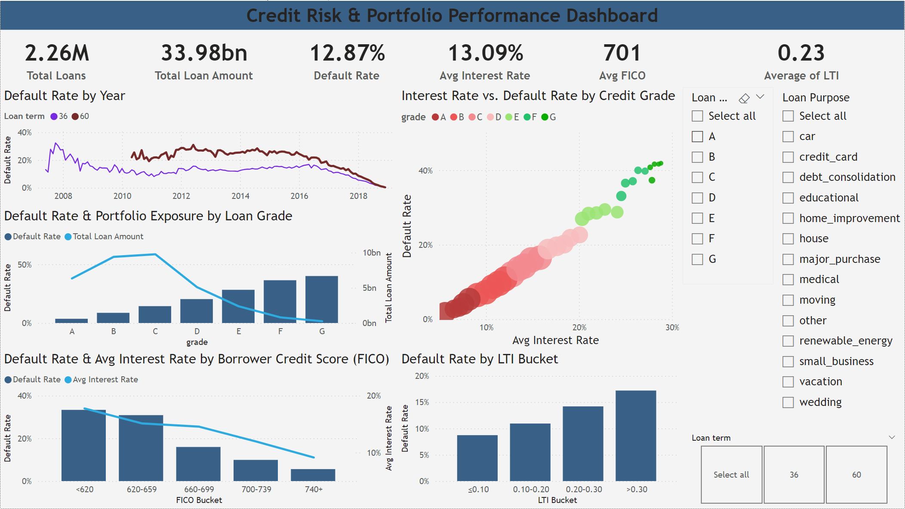

# Credit Risk & Portfolio Analysis

This project analyzes historical loan-level data to evaluate credit default risk across loan grades, borrower credit profiles, and loan structures. The goal is to understand risk-return trade-offs and portfolio exposure.

## Business Questions
- How does default risk vary across loan grades?
- What is the relationship between interest rates and default rates?
- How do borrower credit scores (FICO) and loan-to-income ratios affect default risk?

## Tools & Technologies
- SQL (data cleaning and aggregation)
- Power BI (interactive dashboard)

## Key Insights
- Default rates increase significantly from Grade A to Grade G
- Higher interest rates are strongly associated with higher default rates
- Borrowers with lower FICO scores and higher LTI ratios exhibit higher default risk

## Dashboard Preview

